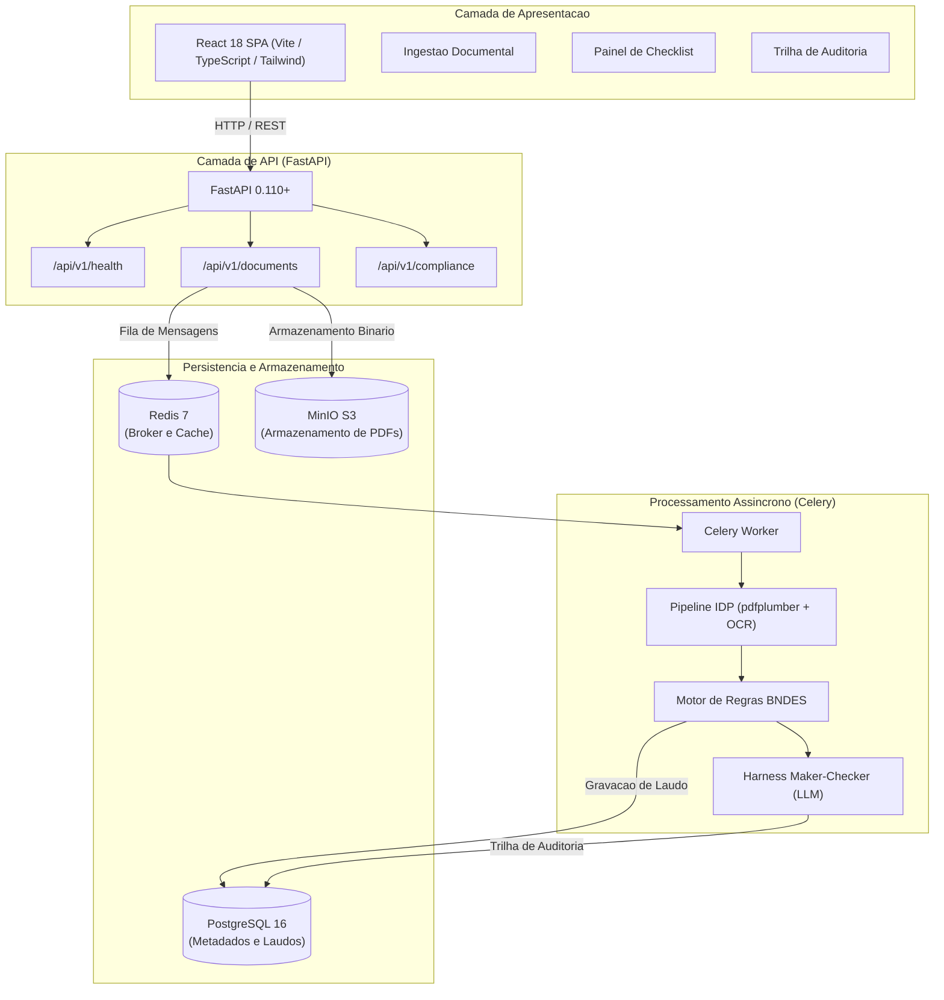

# Conform.IA BNDES - Plataforma de Conformidade Documental

[](https://github.com/conformia-bndes/conformia-platform/actions/workflows/ci.yml)
[](https://conformia-bndes.github.io/conformia-platform/)
[](https://www.python.org/)
[](https://fastapi.tiangolo.com)
[](https://react.dev/)
[](https://www.docker.com/)

Plataforma SaaS de Processamento Inteligente de Documentos (IDP) para verificacao automatizada de conformidade cadastral, fiscal, trabalhista e regulatoria em operacoes de credito e investimentos no BNDES, desenvolvida para atender aos requisitos da Consulta Publica BNDES no 01/2025.

---

## 1. Visao Geral do Projeto

A concessao de apoio financeiro pelo BNDES exige a comprovacao estrita de regularidade documental por parte das empresas proponentes (certidoes negativas de tributos federais, regularidade com o FGTS, certidoes de falencia e concordata, debitos trabalhistas e licencas socioambientais). O processo manual tradicional gera sobrecarga operacional e estende o tempo medio de analise.

O Conform.IA BNDES endereca esse desafio por meio de:
1. **Pipeline IDP Hibrido**: Extracao vetorial nativa de PDFs com fallback automatico para OCR Tesseract em paginas digitalizadas.
2. **Motor de Regras Declarativo**: Avaliacao baseada em schemas JSON normativos com tolerancia zero a pendencias criticas.
3. **Harness Engineering e Padrao Maker-Checker**: Agentes de linguagem operando sob contexto estritamente delimitado com auditoria algoritmica para eliminacao de alucinacoes.
4. **Trilha de Auditoria Imutavel**: Registro cronologico e detalhado de todas as operacoes para compliance e prestacao de contas.

---

## 2. Documentacao Oficial do Projeto

A documentacao tecnica completa, abrangendo especificacoes de engenharia, matriz de requisitos e Registros de Decisao Arquitetural (ADRs), esta publicada no GitHub Pages:

- **Portal de Documentacao**: [https://conformia-bndes.github.io/conformia-platform/](https://conformia-bndes.github.io/conformia-platform/)

Para executar a documentacao localmente com recarregamento a quente:
```bash
make docs
# Acesso local em http://127.0.0.1:8000
```

---

## 3. Arquitetura do Sistema



---

## 4. Matriz de Servicos e Portas

| Servico | Tecnologia | Porta Host | Finalidade |
| :--- | :--- | :--- | :--- |
| **frontend** | React 18 / Vite / Tailwind | `5173` | Interface web para analistas de credito do BNDES |
| **backend** | FastAPI / Python 3.11 | `8000` | API RESTful, ingestao e motor de conformidade |
| **worker** | Celery 5 / Python 3.11 | - | Execucao assincrona de OCR, extracao e regras de IA |
| **postgres** | PostgreSQL 16 Alpine | `5432` | Banco relacional para laudos, documentos e auditoria |
| **redis** | Redis 7 Alpine | `6379` | Broker de mensagens Celery e cache |
| **minio** | MinIO (S3 Compatible) | `9000` / `9001` | Armazenamento de arquivos PDF ingeridos |

---

## 5. Estrutura de Diretorios do Monorepo

```text
conformia-platform/
├── .agents/                      # Diretrizes de Harness Engineering e contexto de agentes
│   └── AGENTS.md                 # Limites operacionais e diretrizes agent-first
├── .github/                      # Governanca, templates e integracao continua
│   ├── CODEOWNERS                # Roteamento automatico de revisao por times
│   ├── PULL_REQUEST_TEMPLATE.md  # Template de PR com Definition of Done formal
│   └── workflows/
│       ├── ci.yml                # Pipeline CI com path-filtering (backend, frontend, sec)
│       └── docs.yml              # Pipeline de publicacao da documentacao no GitHub Pages
├── backend/                      # API FastAPI e nucleo da aplicacao
│   ├── app/
│   │   ├── api/v1/endpoints/     # Rotas da API (health, documents, compliance)
│   │   ├── core/                 # Configuracoes (pydantic-settings) e Celery
│   │   ├── db/models/            # Modelos SQLAlchemy 2.0 (Document, Compliance, Audit)
│   │   ├── idp/                  # Extracao vetorial e fallback OCR Tesseract
│   │   ├── ai/                   # Abstracao de LLM e validador Maker-Checker
│   │   ├── services/             # Motor de regras deterministicas e hibridas
│   │   └── main.py               # Ponto de entrada FastAPI com CORS e middleware
│   ├── tests/                    # Suite de testes automatizados com pytest
│   ├── pyproject.toml            # Configuracoes de empacotamento, black e pytest
│   └── requirements.txt          # Dependencias pinadas do backend
├── docs/                         # Documentacao tecnica completa (MkDocs Material)
│   ├── index.md                  # Pagina inicial da documentacao
│   ├── architecture/             # Visao geral de arquitetura e registros ADR
│   ├── bndes/                    # Analise do edital e tipologias de documentos
│   └── engineering/              # Detalhamento de IDP, motor de regras e Evals
├── evals/                        # Avaliacao Continua e benchmark de regressao
│   ├── README.md                 # Metricas de recall, CER e tolerancia zero
│   └── eval_pipeline.py          # Script automatizado de benchmark de regressao
├── frontend/                     # Aplicacao Web SPA
│   ├── src/
│   │   ├── services/api.ts       # Cliente Axios fortemente tipado
│   │   ├── App.tsx               # Dashboard institucional com abas operacionais
│   │   └── main.tsx              # Ponto de entrada React 18
│   ├── package.json              # Dependencias e scripts do frontend
│   └── vite.config.ts            # Configuracao do servidor de desenvolvimento Vite
├── infra/                        # Infraestrutura conteinerizada oficial
│   ├── docker-compose.yml        # Orquestracao unificada de servicos
│   ├── Dockerfile.backend        # Multi-stage Python 3.11 com Tesseract OCR e Poppler
│   ├── Dockerfile.frontend       # Multi-stage Node 20 com Vite e Nginx
│   └── nginx.conf                # Configuracao de proxy reverso de producao
├── rules/
│   └── schemas/
│       ├── rule_schema.json           # JSON Schema declarativo de regras
│       └── bndes_sample_checklist.json # Checklist referencial BNDES 2025
├── .env.example                  # Modelo de variaveis de ambiente documentadas
├── .gitignore                    # Regras de exclusao de artefatos locais e segredos
├── Makefile                      # Automacao de comandos de desenvolvimento
├── mkdocs.yml                    # Configuracao do gerador de documentacao MkDocs
└── README.md                     # Documento central de apresentacao do repositorio
```

---

## 6. Guia Rapido de Inicializacao

### Pre-requisitos
- Docker Engine >= 24.0 e Docker Compose Plugin >= 2.20
- Make (utilitario de comandos)
- Python 3.11+ e Node.js 20+ (para execucao fora de conteineres)

### 1. Configuracao de Variaveis de Ambiente
```bash
make setup
# O comando cria o arquivo .env a partir de .env.example
```

### 2. Inicializacao dos Servicos
```bash
make up
# Executa docker compose -f infra/docker-compose.yml up --build -d
```

### 3. Rotas e Endpoints de Acesso Local
- **Frontend SPA**: [http://localhost:5173](http://localhost:5173)
- **Documentacao Swagger (OpenAPI)**: [http://localhost:8000/docs](http://localhost:8000/docs)
- **Healthcheck da API**: [http://localhost:8000/api/v1/health](http://localhost:8000/api/v1/health)
- **MinIO Console**: [http://localhost:9001](http://localhost:9001) *(Usuario: `conformia_minio_admin` / Senha: `conformia_minio_secret`)*

---

## 7. Qualidade, Testes e Evals

### Testes Automatizados do Backend
```bash
make test
# Executa a suite de testes com pytest e relatorio de cobertura
```

### Pipeline de Avaliacao Continua (Harness Evals)
```bash
make eval
# Executa a validacao contra casos de teste com tolerancia zero a falsos positivos
```

### Formatacao e Linters
```bash
make lint
make format
```

---

## 8. Governanca e Regras de Contribuicao

1. **Roteamento de Revisao**: Alteracoes estruturais sao encaminhadas automaticamente aos responsaveis designados em `.github/CODEOWNERS`.
2. **Definition of Done (DoD)**: Todo Pull Request deve cumprir rigorosamente o checklist estrito em `.github/PULL_REQUEST_TEMPLATE.md`.
3. **Agentes Autonomos**: Devem operar em estrita conformidade com as diretrizes de contexto delimitado e seguranca estabelecidas em `.agents/AGENTS.md`.
4. **Padrao Estilistico**: Proibicao expressa de emojis em codigos, commits, templates e documentacao.