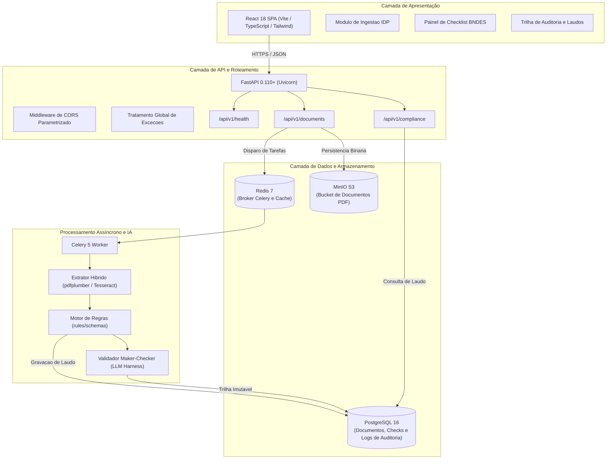

# Visão Geral da Arquitetura

O Conform.IA BNDES adota uma arquitetura modular baseada em microsserviços integrados em monorepo, projetada para desacoplamento de responsabilidades, alta disponibilidade e rastreabilidade total.

---

## Diagrama Estrutural do Sistema

---

## Componentes da Solução

### 1. Camada de Apresentação (Frontend)

- **Tecnologias**: React 18, TypeScript, Tailwind CSS, Lucide Icons, Axios.
- **Responsabilidade**: Fornecer interface reativa para analistas de crédito e operadores do BNDES, permitindo o carregamento de PDFs, visualização imediata de pendências e consulta do histórico de auditoria.

### 2. Camada de API (Backend Core)

- **Tecnologias**: Python 3.11, FastAPI, SQLAlchemy 2.0, Pydantic v2, Pydantic-Settings.
- **Responsabilidade**: Exposicao de endpoints RESTful seguros, validacao estrita de contratos de entrada, gestao de conexoes e persistencia de estado.

### 3. Camada de Processamento Assíncrono (Worker)

- **Tecnologias**: Celery, Redis, pdfplumber, pytesseract, Poppler-utils.
- **Responsabilidade**: Processamento de arquivos pesados, OCR em paginas digitalizadas e execucao de regras de conformidade sem bloqueio das requisicoes HTTP da API.

### 4. Camada de Persistência

- **PostgreSQL 16**: Armazena entidades estruturadas (`Document`, `ComplianceCheck`, `AuditLog`).
- **Redis 7**: Fila de mensagens para tarefas do Celery e cache de regras frequentes.
- **MinIO**: Object storage compativel com a API S3 para persistencia duravel dos arquivos PDF originais.

---

## Fluxo de Processamento de Documentos

1. **Ingestão**: O usuário envia um PDF através da interface ou de uma chamada de API (`POST /api/v1/documents/upload`).
2. **Armazenamento**: O arquivo é salvo no volume seguro, e um registro inicial é criado no banco com status `PROCESSING`.
3. **Extração IDP**: O extrator processa as páginas nativas. Se a densidade textual for inferior ao limiar mínimo, o OCR via Tesseract é acionado.
4. **Avaliação de Conformidade**: O motor de regras compara o texto extraído com o catálogo normativo (BNDES 01/2025). Regras semânticas são validadas pelo ciclo Maker-Checker.
5. **Auditoria**: O resultado é consolidado, salvo no banco e registrado na tabela de auditoria (`audit_logs`).
