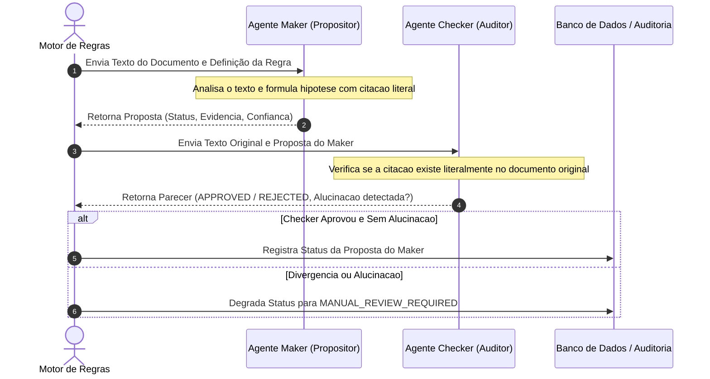

# Harness Engineering e Avaliação Contínua de IA (Evals)

Em aplicações que envolvem auditoria de crédito público e contratações de grande porte no BNDES, a aplicação de modelos de linguagem (LLMs) requer governança rigorosa contra alucinações, vieses e instabilidades de geração. O Conform.IA BNDES adota os princípios de **Harness Engineering**.

---

## 1. O Padrao Maker-Checker

Para eliminar o risco de alucinações em que o modelo infere erroneamente a conformidade de uma empresa, o sistema implementa a arquitetura de **Quatro Olhos Algorítmico (Maker-Checker)**:



### 1.1 Responsabilidades do Maker

- Formula uma hipótese preliminar de avaliação baseada exclusivamente no trecho documental fornecido.
- Deve obrigatoriamente indicar o valor exato extraido e a justificativa logica.
- Restrito a esquemas de saida estruturados em JSON via Pydantic.

### 1.2 Responsabilidades do Checker

- Opera de forma totalmente desacoplada e independente do Maker.
- Audita se o trecho citado pelo Maker esta realmente contido no texto original do PDF.
- Em caso de inconsistencia textual ou extrapolacao de contexto, o Checker invalida a hipotese, forçando o encaminhamento para analise humana.

---

## 2. Metricas e Limiares Operacionais de Evals

O pipeline de avaliacao continua (`evals/eval_pipeline.py`) monitora regressões atraves de casos de teste sinteticos e reais anonimizados:

| Dimensao              | Indicador                        | Meta                       | Limiar de Alerta        |
| :-------------------- | :------------------------------- | :------------------------- | :---------------------- |
| **Seguranca**         | Falsos Positivos de Conformidade | **0.0%** (Tolerancia Zero) | $> 0.0\%$ (Bloqueia CI) |
| **Qualidade IDP**     | Character Error Rate (CER)       | $\le 1.5\%$                | $> 3.0\%$               |
| **Extracao**          | Recall de Entidades Chave        | $\ge 98.5\%$               | $< 95.0\%$              |
| **Confiabilidade IA** | Taxa de Deteccao de Alucinacao   | $\ge 99.0\%$               | $< 98.0\%$              |
| **Consenso**          | Maker-Checker Agreement Rate     | $\ge 95.0\%$               | $< 90.0\%$              |

---

## 3. Execucao de Benchmarks de Regressao

O benchmark de Evals e executado localmente via:

```bash
python evals/eval_pipeline.py
```

O comando realiza o teste funcional completo contra o conjunto de regras do BNDES, verificando se documentos com falencia decretada ou pendencias fiscais sao rejeitados com precisao absoluta.
