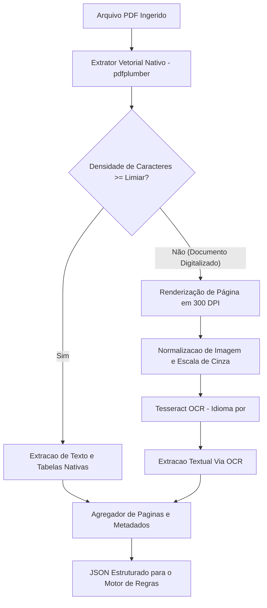

# Pipeline de Processamento Inteligente de Documentos (IDP)

O pipeline de IDP do Conform.IA BNDES e responsavel pela conversao de documentos binarios PDF em representacoes textuais estruturadas, tabelas e metadados normalizados.

---

## 1. Arquitetura do Extrator Híbrido

O processamento adota uma abordagem em duas etapas:



---

## 2. Estrategia de Fallback para OCR

1. **Analise Vetorial Primaria**:
   - O arquivo PDF e aberto utilizando `pdfplumber`.
   - Para cada pagina, avalia-se o volume de caracteres nativos extraiveis.
2. **Deteccao de Paginas Digitalizadas (Scanned Pages)**:
   - Se a contagem de caracteres da pagina for inferior ao limiar configurado (`min_char_threshold`, padrao: 50 caracteres), a pagina e classificada como imagem digitalizada.
3. **Execucao do OCR**:
   - A pagina e rasterizada com densidade otimizada de 300 DPI (`page.to_image(resolution=300)`).
   - O Tesseract OCR e acionado configurado para o dicionario de Lingua Portuguesa (`tesseract-ocr-por`).
   - O resultado do OCR e integrado a representacao textual unificada do documento, marcando o atributo `is_scanned: true`.

---

## 3. Estrutura de Dados de Saida do Pipeline

O extrator retorna uma estrutura formal serializavel com o seguinte formato:

```json
{
  "file_path": "/tmp/conformia_uploads/doc-uuid-123.pdf",
  "metadata": {
    "total_pages": 3,
    "pdf_metadata": {
      "Author": "Receita Federal",
      "CreationDate": "D:20260115"
    },
    "has_scanned_pages": false
  },
  "pages": [
    {
      "page_number": 1,
      "text": "CERTIDAO NEGATIVA DE DEBITOS...",
      "tables": [],
      "is_scanned": false,
      "char_count": 1420
    }
  ],
  "full_text": "CERTIDAO NEGATIVA DE DEBITOS...\n\n--- [QUEBRA DE PAGINA] ---\n\n..."
}
```

---

## 4. Tratamento de Excecoes e Resiliencia

- Documentos corrompidos ou com senha geram erro `RuntimeError` capturado de forma transparente pela API, registrando status `EXTRACTION_FAILED` no banco relacional.
- Limite maximo de processamento por documento configurado no worker Celery (`task_time_limit: 600 segundos`).
