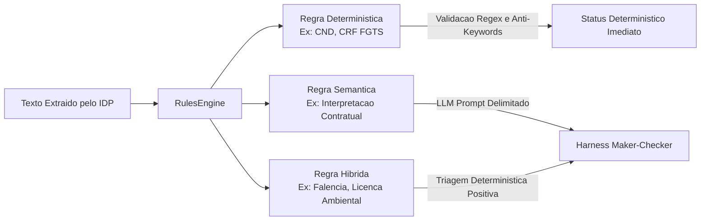

# Motor de Regras e Conformidade Declarativa

O Motor de Regras do Conform.IA BNDES (`app.services.rules_engine.RulesEngine`) e o nucleo responsavel por interpretar os requisitos normativos do BNDES e avaliar o texto extraido dos documentos.

---

## 1. Tipologia de Regras de Conformidade

O sistema suporta três modalidades de avaliação:

### 1.1 Regras Deterministicas (`DETERMINISTIC`)

- Executadas via busca booleana exata, correspondencia de expressoes regulares e validacao de termos impeditivos (_anti-keywords_).
- **Exemplo**: Certidao Negativa de Debitos Federais. Se os termos `"CERTIDAO NEGATIVA"`, `"TRIBUTOS FEDERAIS"` e `"DIVIDA ATIVA DA UNIAO"` estiverem presentes, e nenhum termo como `"CONSTA PENDENCIA"` for detectado, o resultado e `COMPLIANT`.

### 1.2 Regras Hibridas (`HYBRID`)

- Aplicadas a documentos onde o vocabulário pode variar por comarca ou orgao regional (ex: certidoes de falencia).
- O motor realiza uma triagem determinística inicial. Se os termos fundamentais forem localizados, o texto relevante é submetido ao orquestrador **Maker-Checker** para auditoria semântica e confirmação de ausência de passivos.

---

## 2. Estrutura do Esquema Declarativo (JSON Schema)

As regras são externalizadas do código-fonte da aplicação e versionadas em `rules/schemas/rule_schema.json`. O checklist de referência reside em `rules/schemas/bndes_sample_checklist.json`.

Propriedades fundamentais de cada regra:

- `id`: Identificador unico (ex: `RULE-BNDES-001`).
- `code`: Mnemonico operacional (ex: `CND_FEDERAL`).
- `category`: Classificacao tematica (`FISCAL`, `TRABALHISTA`, `JURIDICA`, `AMBIENTAL`, `INTEGRIDADE`).
- `severity`: Nivel de bloqueio no credito (`CRITICAL`, `HIGH`, `MEDIUM`, `LOW`).
- `required_keywords`: Termos textuais obrigatorios.
- `anti_keywords`: Termos cuja presenca reprova a certidao sumariamente.
- `regex_patterns`: Padroes formais (CNPJ, formato de datas, codigos alfanumericos).
- `failure_message`: Mensagem institucional exibida no laudo.

---

## 3. Estados de Conformidade e Pontuacao

Cada verificacao resulta em um dos seguintes estados formais:

- `COMPLIANT`: O documento atende plenamente aos requisitos legais.
- `NON_COMPLIANT`: Identificada irregularidade insuperavel, pendencia fiscal ou ausencia de requisito mandatorio.
- `MANUAL_REVIEW_REQUIRED`: Incerteza semantica, divergencia no Maker-Checker ou informacao com baixa legibilidade.
- `NOT_APPLICABLE`: Requisito dispensado conforme a modalidade do proponente.

O **Score de Conformidade** e calculado pela razao entre regras cumpridas e o total de regras ativas aplicaveis:

$$\text{Compliance Score} = \frac{\sum \text{Regras Aprovadas}}{\text{Total de Regras Aplicaveis}}$$
