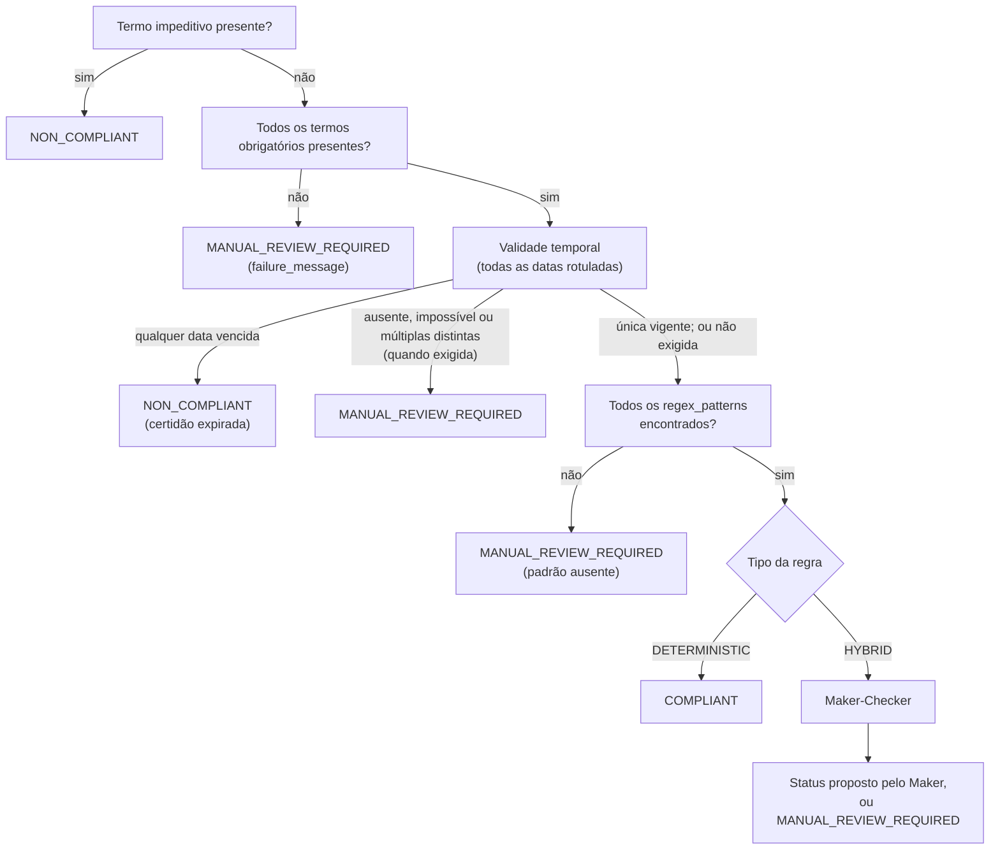

# Motor de Regras

O motor de regras (`backend/app/services/rules_engine.py`, classe `RulesEngine`) avalia o texto
extraído de um documento contra o checklist declarativo do BNDES e produz o laudo de
conformidade. As regras ficam fora do código, em JSON versionado.

---

## 1. Checklist declarativo

| Arquivo | Conteúdo |
| :-- | :-- |
| `rules/schemas/rule_schema.json` | JSON Schema que valida a estrutura de cada regra |
| `rules/schemas/bndes_sample_checklist.json` | Checklist de referência do MVP (6 regras) |

| ID | Código (tipologia) | Categoria | Tipo | Severidade | Validade obrigatória |
| :-- | :-- | :-- | :-- | :-- | :-- |
| RULE-BNDES-001 | `CND_FEDERAL` | FISCAL | DETERMINISTIC | CRITICAL | Sim |
| RULE-BNDES-002 | `CRF_FGTS` | TRABALHISTA | DETERMINISTIC | CRITICAL | Sim |
| RULE-BNDES-003 | `CNDT_TRABALHISTA` | TRABALHISTA | DETERMINISTIC | CRITICAL | Sim |
| RULE-BNDES-004 | `FALENCIA_RECUPERACAO` | JURÍDICA | HYBRID | CRITICAL | Não |
| RULE-BNDES-005 | `LICENCA_AMBIENTAL` | AMBIENTAL | HYBRID | HIGH | Não |
| RULE-BNDES-006 | `INTEGRIDADE_CEIS_CNEP` | INTEGRIDADE | HYBRID | CRITICAL | Não |

> **Detecção de tipologia:** as seis regras têm detecção no parser, incluindo a RULE-BNDES-005
> (`LICENCA_AMBIENTAL`) e a RULE-BNDES-006 (`INTEGRIDADE_CEIS_CNEP`). Os critérios de cada
> tipologia e a precedência entre elas estão em `docs/bndes/document-types.md`.

Campos de cada regra:

| Campo | Uso |
| :-- | :-- |
| `id`, `code`, `title` | Identificação. O `code` é a tipologia do documento a que a regra se aplica |
| `category`, `severity`, `legal_basis` | Classificação e fundamento normativo exibidos no laudo |
| `type` | `DETERMINISTIC` ou `HYBRID` |
| `required_keywords` | Termos que precisam estar todos presentes |
| `anti_keywords` | Termos impeditivos: a presença não negada de qualquer um reprova a regra (`NON_COMPLIANT`) |
| `manual_review_keywords` | Termos sensíveis que impedem aprovação automática e encaminham para `MANUAL_REVIEW_REQUIRED` |
| `regex_patterns` | Padrões estruturais obrigatórios (ex.: CNPJ, código CRF); a ausência de qualquer padrão encaminha para `MANUAL_REVIEW_REQUIRED` (decisão D2) e os padrões encontrados são registrados como evidência |
| `requires_validity` | Exige data de validade legível. Ausente, vale `true` para FISCAL e TRABALHISTA |
| `failure_message` | Mensagem do laudo quando os termos obrigatórios não são encontrados (laudo em revisão manual) |

---

## 2. Seleção das regras por tipologia

O parser IDP identifica a tipologia do documento (por exemplo `CND_FEDERAL`). O motor avalia
**somente as regras cujo `code` corresponde à tipologia**; as demais entram no laudo como
`NOT_APPLICABLE`. Sem esse filtro, uma CND válida seria reprovada por não ser um CRF do FGTS.

Quando a tipologia não é identificada, o serviço chama `RulesEngine.not_evaluable()`: nenhuma
regra é aplicada, todas ficam `NOT_APPLICABLE` e o laudo geral é `MANUAL_REVIEW_REQUIRED`. A
ausência de avaliação nunca equivale a conformidade.

---

## 3. Avaliação de uma regra

O texto é normalizado (sem acentos, em maiúsculas) e as etapas são aplicadas em ordem; a
primeira que decide encerra a avaliação.

```mermaid
flowchart TD
    A["Termo impeditivo presente?"] -->|sim| NC1["NON_COMPLIANT"]
    A -->|não| B["Todos os termos obrigatórios presentes?"]
    B -->|não| MR0["MANUAL_REVIEW_REQUIRED<br/>(failure_message)"]
    B -->|sim| C["Validade temporal<br/>(todas as datas rotuladas)"]
    C -->|"qualquer data vencida"| NC3["NON_COMPLIANT<br/>(certidão expirada)"]
    C -->|"ausente, impossível ou múltiplas distintas<br/>(quando exigida)"| MR["MANUAL_REVIEW_REQUIRED"]
    C -->|"única vigente; ou não exigida"| P["Todos os regex_patterns<br/>encontrados?"]
    P -->|não| MR1["MANUAL_REVIEW_REQUIRED<br/>(padrão ausente)"]
    P -->|sim| D{"Tipo da regra"}
    D -->|DETERMINISTIC| OK["COMPLIANT"]
    D -->|HYBRID| MC["Maker-Checker"]
    MC --> R["Status proposto pelo Maker,<br/>ou MANUAL_REVIEW_REQUIRED"]
```

**Validade temporal (fonte única com o parser IDP).** A função `scan_validity_dates`
(`backend/app/idp/parser.py`) localiza todas as datas rotuladas como validade ou vigência
("válida até", "validade", "vigência", "data de validade", "prazo de validade" ou "até" seguido
de `dd/mm/aaaa`); datas de emissão não entram na análise. A certidão vale até o fim do dia
indicado e a decisão segue a tabela abaixo:

| Situação no texto | Resultado (`requires_validity=true`) |
| :-- | :-- |
| Nenhuma data de validade | `MANUAL_REVIEW_REQUIRED` |
| Somente datas impossíveis (ex.: `31/02/2026`) | `MANUAL_REVIEW_REQUIRED` |
| Qualquer data válida vencida (mesmo havendo outra vigente) | `NON_COMPLIANT` |
| Várias datas válidas vigentes e diferentes entre si (ou data vigente + impossível) | `MANUAL_REVIEW_REQUIRED` |
| Uma única data válida vigente (ainda que repetida em múltiplas páginas) | Segue para as demais verificações |

**Validação de `regex_patterns`.** Os padrões declarados em `regex_patterns` (como CNPJ em CND,
CRF e CNDT, e número `CRF...` no CRF) são critérios de validação obrigatórios: quando algum padrão
não é encontrado no documento, a regra termina em `MANUAL_REVIEW_REQUIRED` (política D2), nunca em
`COMPLIANT`.

**Regras híbridas.** Depois da triagem determinística, a regra segue para o
[Maker-Checker](maker-checker.md). Se o LLM estiver indisponível, responder fora do formato ou
citar um trecho que não existe no documento, o resultado é `MANUAL_REVIEW_REQUIRED`.

---

## 4. Estados e consolidação do laudo

A falta de um termo obrigatório vai para revisão manual (decisão D2): ela indica um documento
ilegível ou incompleto, não uma irregularidade comprovada. Só termos impeditivos e validade vencida
reprovam de forma definitiva.

| Status | Significado |
| :-- | :-- |
| `COMPLIANT` | Todos os critérios da regra foram atendidos |
| `NON_COMPLIANT` | Termo impeditivo ou certidão vencida |
| `MANUAL_REVIEW_REQUIRED` | Termo obrigatório ausente (ex.: OCR ilegível), validade ilegível, tipologia não identificada ou avaliação semântica não confirmada |
| `NOT_APPLICABLE` | A regra não se aplica à tipologia do documento |

A função `summarize_statuses` consolida o laudo **ignorando as regras `NOT_APPLICABLE`**:

1. Qualquer `NON_COMPLIANT` → laudo `NON_COMPLIANT`.
2. Senão, qualquer `MANUAL_REVIEW_REQUIRED` (ou score abaixo de 1) → `MANUAL_REVIEW_REQUIRED`.
3. Senão → `COMPLIANT`.

O score é a fração de regras aplicáveis em `COMPLIANT`. Sem nenhuma regra aplicável, o score é
0 e o laudo vai para revisão manual.

---

## 5. Como adicionar ou alterar uma regra

1. Editar `rules/schemas/bndes_sample_checklist.json` respeitando `rule_schema.json`.
2. Incluir casos no benchmark (`evals/datasets/`) que provem a aprovação e a reprovação da regra.
3. Rodar `make eval`: o CI bloqueia qualquer falso positivo ou acurácia abaixo de 90%.
4. Abrir o PR com o resultado do benchmark. Ver [Avaliação contínua](harness-evals.md).
