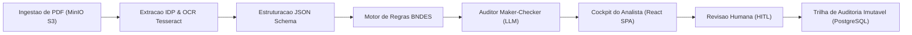

# Conform.IA BNDES — Documentacao Tecnica e de Engenharia

Plataforma SaaS de Processamento Inteligente de Documentos (IDP) e Auditoria Imutavel concebida para atender aos requisitos da **Consulta Publica BNDES no 01/2025** (Checklist de Conformidade).

---

## Indicadores de Desempenho e Qualidade do Projeto

0.00%

Falsos Positivos (Tolerancia Zero)

100.0%

Acuracia nos Benchmarks de Evals

8 Sprints

Cronograma ate 07/12/2026

15 RFs

Requisitos Funcionais Mapeados

---

## Mapa Geral da Documentacao

Navegue pelos modulos tecnicos da plataforma:

- ### [Planejamento Estrategico](planning/index.md)
    Contexto do edital BNDES, requisitos funcionais RF01 a RF15, roadmap de sprints e Definition of Done.
    - [Visao Geral do Planejamento](planning/index.md)
    - [Requisitos de Negocio e RF01-RF15](planning/requirements.md)
    - [Arquitetura e Segregacao Regras/IA](planning/architecture-design.md)
    - [Cronograma de Sprints e Backlog](planning/sprints-roadmap.md)
    - [Seguranca, LGPD e Auditoria](planning/governance-security.md)
    - [Harness Engineering e Maker-Checker](planning/harness-engineering.md)

- ### [Arquitetura e Decisoes (ADRs)](architecture/overview.md)
    Topologia de micro-servicos, diagramas de fluxo, especificacao de componentes e registros formais de decisao.
    - [Visao Geral da Arquitetura](architecture/overview.md)
    - [Indice de ADRs](architecture/adr-index.md)
    - [ADR-001: Monorepo Modular](architecture/adr-001-monorepo-modular.md)
    - [ADR-002: Adoção do Astral uv](architecture/adr-002-astral-uv-toolchain.md)
    - [ADR-003: React SPA vs Next.js](architecture/adr-003-spa-vs-nextjs.md)

- ### [Desafio e Conformidade BNDES](bndes/compliance-matrix.md)
    Mapeamento minucioso dos itens do edital BNDES e especificacao tecnica das tipologias de certidoes.
    - [Matriz de Aderencia ao Edital](bndes/compliance-matrix.md)
    - [Tipologias de Documentos (CND, FGTS, CNDT, Falencia)](bndes/document-types.md)

- ### [Engenharia de IDP e IA](engineering/idp-pipeline.md)
    Pipeline de ingestao, OCR Tesseract, motor determinístico de regras e avaliacao continua de IA.
    - [Pipeline IDP e OCR Hibrido](engineering/idp-pipeline.md)
    - [Motor de Regras Declarativo](engineering/rules-engine.md)
    - [Harness Maker-Checker e Evals](engineering/harness-evals.md)

- ### [Desenvolvimento e APIs](development/quickstart.md)
    Guias operacionais para desenvolvimento local, contratos OpenAPI e protocolos de qualidade pre-commit.
    - [Guia de Inicio Rapido (Quickstart)](development/quickstart.md)
    - [Referencia da API REST (OpenAPI)](development/api-reference.md)
    - [Quality Gates e Protocolos de Teste](development/quality-gates.md)

---

## Arquitetura de Alto Nivel

---

## Pontos de Acesso em Ambiente Local

| Servico | URL Host | Finalidade Operacional |
| :--- | :--- | :--- |
| **Frontend SPA** | [http://localhost:5173](http://localhost:5173) | Cockpit do analista de credito para revisao e envio de certidoes. |
| **Backend API (Swagger Docs)** | [http://localhost:8000/docs](http://localhost:8000/docs) | Catalogo interativo OpenAPI / Swagger das rotas da API. |
| **Healthcheck da API** | [http://localhost:8000/api/v1/health](http://localhost:8000/api/v1/health) | Diagnostico em tempo real do PostgreSQL, Redis e MinIO. |
| **MinIO Console** | [http://localhost:9001](http://localhost:9001) | Interface web do S3 Object Storage para inspecao de PDFs originais. |
| **Documentacao MkDocs** | [http://127.0.0.1:8000](http://127.0.0.1:8000) | Servidor local com recarregamento a quente via `make docs`. |
