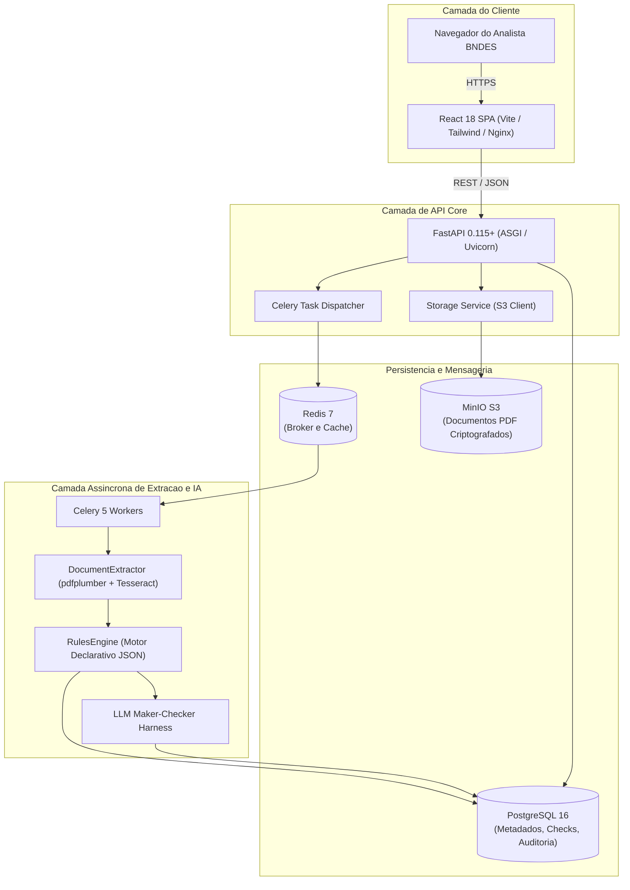

# Arquitetura de Software e Engenharia de Solução

Este documento estabelece as diretrizes arquiteturais, a topologia de serviços, a matriz de seleção tecnológica e o modelo de resultado adotado na plataforma Conform.IA BNDES.

---

## 1. Topologia de Serviços e Fluxo de Dados

A solução adota uma arquitetura conteinerizada desacoplada, separando o ciclo HTTP da API do processamento computacionalmente intensivo de IDP e IA:



---

## 2. Matriz de Tecnologias e Justificativa de Engenharia

| Componente                   | Tecnologia Selecionada                 | Justificativa Técnica e Compensações                                                                                                                                                 |
| :--------------------------- | :------------------------------------- | :----------------------------------------------------------------------------------------------------------------------------------------------------------------------------------- |
| **Frontend SPA**             | React 18 + Vite + Tailwind CSS         | Compilação estática servida via Nginx (contêiner < 25 MB), sem necessidade de servidor Node.js em produção, sem problemas de hidratação com visualizadores de PDF e HMR instantâneo. |
| **Backend API**              | Python 3.11/3.13 + FastAPI + Uvicorn   | Ecossistema maduro para engenharia de dados e IA, suporte assíncrono de alto rendimento e contratos tipados com Pydantic v2.                                                         |
| **Gerenciador de Pacotes**   | Astral `uv`                            | Resolução de dependências em milissegundos, workspace monorepo nativo e lockfile determinístico (`uv.lock`) para reprodutibilidade estrita.                                          |
| **Banco Relacional**         | PostgreSQL 16 Alpine                   | Persistencia transacional ACID, suporte a consultas relacionais e integridade referencial compulsoria para trilhas de auditoria.                                                     |
| **Broker de Mensagens**      | Redis 7 Alpine                         | Fila em memoria de baixissima latencia para despacho assincrono entre API e workers de extracao.                                                                                     |
| **Processamento Assincrono** | Celery 5                               | Isolamento de operacoes bloqueantes (OCR, extracao e chamadas a modelos de IA) do ciclo de vida das requisicoes HTTP da API.                                                         |
| **Armazenamento de Objetos** | MinIO S3 Compatible                    | Compatibilidade estrita com a API AWS S3, facilitando execucao local e migracao transparente para nuvens soberanas brasileiras.                                                      |
| **Extracao Vetorial e OCR**  | pdfplumber + Tesseract OCR 5 + Poppler | Solucao auditavel, sem envio de documentos confidenciais a nuvens de terceiros e com calibracao para o idioma portugues (`por`).                                                     |
| **Orquestracao Local**       | Docker Compose v2                      | Orquestracao declarativa unificada em `infra/docker-compose.yml`, eliminando divergencias entre ambientes.                                                                           |

---

## 3. Por que Separar Regras de Negocio de Modelos de IA?

Um dos riscos mais criticos em aplicacoes de IA no setor publico e a **alucinacao de modelos** ou o afrouxamento inadvertido de criterios normativos devido a mudancas sutis em prompts.

Para mitigar esse risco de forma definitiva:

1. **Regras Determinísticas e Matematicas** (validade temporal, calculo de datas, expressoes regulares de CNPJ, identificacao literal de certidao negativa):
   - Sao executadas pelo **Motor de Regras** determinístico.
   - Nao dependem de inferencia probabilistica.
   - Qualquer falha gera imediatamente o status `NON_COMPLIANT`.
2. **Avaliacao Semantica Assistida por IA** (interpretacao de clausulas societarias complexas, ressalvas juridicas em certidoes narrativas):
   - Sao executadas pelo pipeline **Maker-Checker**.
   - O modelo **Maker** aponta a evidencia e formula uma hipotese.
   - O modelo/algoritmo **Checker** valida se o texto citado existe textualmente no documento original antes de admitir o laudo.
   - Se houver qualquer divergencia ou baixa confianca, o status e obrigatoriamente degradado para `MANUAL_REVIEW_REQUIRED`.

---

## 4. Modelo de Resultado de Conformidade (Schema de Laudo)

Cada verificacao de criterio normativo produz um registro estruturado no seguinte padrao:

```json
{
  "report_id": "rep-8a9d1b-2026",
  "document_id": "doc-550e8400-e29b-41d4-a716-446655440000",
  "checklist_version": "1.0.0",
  "evaluated_at": "2026-09-27T03:45:00Z",
  "overall_status": "COMPLIANT",
  "checks": [
    {
      "rule_id": "RULE-BNDES-001",
      "code": "CND_FEDERAL",
      "status": "COMPLIANT",
      "severity": "CRITICAL",
      "evidence": {
        "page_number": 1,
        "exact_quote": "Certidão Negativa de Débitos Relativos a Créditos Tributários Federais",
        "bounding_box": [120, 45, 480, 85],
        "confidence_score": 0.99
      },
      "evaluated_by": "RULES_ENGINE_DETERMINISTIC",
      "notes": "Validade regular ate 15/12/2026 com base no Decreto-Lei nº 147/1967."
    }
  ]
}
```
