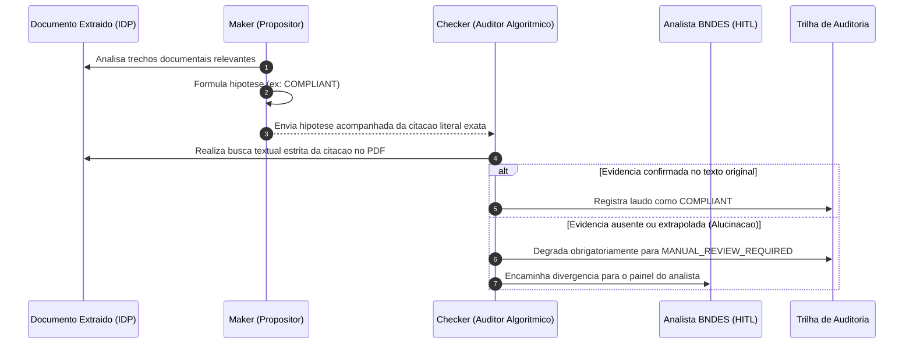

# Harness Engineering e Operacao de Agentes

Este documento formaliza os principios de **Harness Engineering** aplicados no desenvolvimento e na operacao da plataforma Conform.IA BNDES, alinhando as diretrizes institucionais do projeto ao padrao agent-first estabelecido em `.agents/AGENTS.md`.

---

## 1. O Conceito de Harness Engineering

Harness Engineering e a disciplina de engenharia que envolve modelos e agentes de IA com **condicoes estritas de contorno, contexto rigorosamente delimitado, ferramentas de minimo privilegio, estado persistente e mecanismos de verificacao automatica**.

A confiabilidade de um sistema de decisao critica nao depende do texto isolado de um prompt, mas sim da solidez do *harness* que governa sua execucao.

---

## 2. As Duas Dimensoes de Harness na Plataforma

```mermaid
flowchart TD
    subgraph HarnessDev["1. Harness do Desenvolvimento (Engenharia de Software)"]
        AgenteDev["Agente Autonomo de IA"]
        ContextoGit["Contexto de Monorepo (.agents, docs)"]
        FerramentasLocais["Ferramentas Estritas (pytest, uv, git)"]
        QualityGate["Quality Gate (Black, Flake8, Evals)"]
        AgenteDev --> ContextoGit --> FerramentasLocais --> QualityGate
    end

    subgraph HarnessProd["2. Harness do Produto (Orquestracao Documental BNDES)"]
        PDF["Documento PDF Ingerido"]
        ExtratorIDP["Pipeline IDP (Texto + OCR)"]
        Maker["Propositor Maker (LLM)"]
        Checker["Auditor Checker (Determinístico)"]
        HITL["Revisao Humana (Analista BNDES)"]
        PDF --> ExtratorIDP --> Maker --> Checker --> HITL
    end
```

### 2.1 Harness do Desenvolvimento (Agent-First Engineering)
Controla como agentes autonomos auxiliam na construcao do software. O agente nao possui permissao para executar comandos destrutivos (`--force`, `drop table`, `rm -rf`), opera sob convenções estritas (Conventional Commits, ausencia de emojis) e deve validar cada incremento com testes reais antes de qualquer conclusao.

### 2.2 Harness do Produto (In-App Document Orchestration)
Controla a execucao interna da IA durante a analise documental. O modelo recebe apenas trechos delimitados de texto, esquemas Pydantic rigidos e instrucoes declarativas.

---

## 3. O Padrao Maker-Checker (Quatro Olhos Algoritmico)

Para erradicar qualquer possibilidade de aprovacao indevida por alucinacao semantica, a verificacao de clausulas e documentos adota o padrao **Maker-Checker**:

---

## 4. Guardrails e Limites Operacionais Inviolaveis

Conforme definido no estatuto de operacao em `.agents/AGENTS.md`, vigoram os seguintes limites absolutos:

1. **Nunca Assumir Validade por Ausencia de Dados**:
   - Se uma certidao nao contem a data de validade de forma legivel, ela deve ser marcada como `MANUAL_REVIEW_REQUIRED`, nunca como `COMPLIANT`.
2. **Minimo Privilegio de Ferramentas**:
   - As ferramentas acessiveis aos agentes de extracao sao estritamente de leitura sobre o documento. Apenas a camada transacional de servicos grava no banco.
3. **Protecao de PII e Sigilo Bancario**:
   - Logs e traces OpenTelemetry sao higienizados para nao expor CPF ou dados bancarios de socios proponentes.
4. **Validacao Estrita de Regras**:
   - Nenhuma regra pode ser adicionada a `rules/schemas/` sem que haja um caso de teste correspondente no benchmark de `evals/eval_pipeline.py`.
