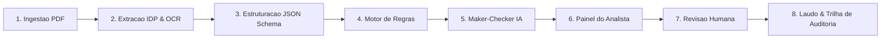

# Planejamento Inicial de Projeto — Conform.IA BNDES

**Plataforma de Intelligent Document Processing para Verificação Automatizada de Conformidade**
_Documento Inicial de Direcionamento Técnico_

---

## Informações Gerais e Parâmetros de Projeto

| Parâmetro                           | Definição Inicial                                                                            |
| :---------------------------------- | :------------------------------------------------------------------------------------------- |
| **Desafio de Referência**           | Consulta Pública BNDES nº 01/2025 — Checklist de Conformidade                                |
| **Data de Encerramento do Projeto** | 07/12/2026                                                                                   |
| **Modalidade Proposta**             | SaaS, com arquitetura preparada para hospedagem e tratamento de dados em território nacional |
| **Público-Alvo Principal**          | Analistas de crédito, revisores e administradores envolvidos na verificação de conformidade  |
| **Status do Documento**             | Versão inicial de planejamento — sujeita a refinamento após validação dos requisitos e dados |
| **Localidade e Data**               | Brasília — DF, setembro de 2026                                                              |

---

## 1. Resumo Executivo

O presente documento estabelece o planejamento inicial da solução **Conform.IA BNDES**, concebida para responder ao desafio apresentado pelo Banco Nacional de Desenvolvimento Econômico e Social (BNDES) na Consulta Pública nº 01/2025. O desafio consiste em interpretar automaticamente documentos não estruturados e aplicar regras de negócio para verificar conformidade, confrontando informações extraídas dos documentos com normativos internos, bases de dados e sistemas de tecnologia da informação.

A proposta parte de uma arquitetura de Intelligent Document Processing (IDP), combinando ingestão documental, OCR e extração estruturada, mecanismos de interpretação assistidos por IA, motor de regras parametrizável, integração com fontes externas, interface de revisão humana, rastreabilidade e geração de relatórios auditáveis.

O objetivo do projeto é construir um MVP tecnicamente demonstrável, priorizando um fluxo ponta a ponta: receber um documento, extrair informações, executar pontos de um checklist, apresentar evidências e resultados, registrar a trilha de auditoria e permitir revisão humana. A solução é concebida desde o início com segurança, governança, observabilidade e capacidade de avaliação de acurácia.

### 1.1 Objetivos do Planejamento

- Traduzir o problema do BNDES em requisitos de produto e requisitos tecnicos verificaveis.
- Definir uma arquitetura inicial compativel com IDP, IA, regras de negocio, integracao e auditoria.
- Estabelecer um MVP com escopo controlado e criterios objetivos de aceite.
- Organizar a execucao em sprints estruturadas ate 07/12/2026.
- Incorporar praticas de Harness Engineering ao processo de desenvolvimento assistido por agentes de IA.
- Criar uma base solida para evolucao futura para multiplos tipos de documentos, checklists, integracoes e modelos de IA.

### 1.2 Premissa de Escopo

O edital disponibilizado nao fornece amostras reais de documentos confidenciais do BNDES, contratos de APIs internas ou o conjunto completo de regras de negocio normativas. Assim, o MVP utiliza documentos e dados sinteticos autorizados, mantendo interfaces de integracao desacopladas por meio de adaptadores e contratos tipados para posterior conexao a fontes reais de producao.

---

## 2. Edital de Referencia e Entendimento do Desafio

A referencia primaria deste planejamento e a **CONSULTA PUBLICA BNDES No 01/2025**, cujo objeto e verificar a adequacao de solucoes voltadas a interpretacao automatizada de documentos nao estruturados e a aplicacao de regras de negocio para verificacao de conformidade. O edital explicita que a conferencia deve relacionar informacoes dos documentos a normativos internos e dados de bases e sistemas de TI, buscando eficiencia, rastreabilidade e seguranca na tomada de decisao institucional.

- **Documento de Referencia**: Consulta Publica BNDES no 01/2025 (Errata de 17/09/2025).
- **Plataforma Indicada**: WorldLabs — Consulta BNDES Checklist de Conformidade.

### 2.1 Contexto Apresentado pelo BNDES

Segundo o edital, o BNDES atua em operacoes de concessao de credito, investimento e desinvestimento, ofertas publicas, selecao e contratacao de fundos FIP/FIDC, alteracoes de condicoes financeiras, renegociacoes de credito e estruturacao de projetos. As verificacoes de conformidade sao realizadas por meio de checklists compostos por criterios definidos em normativos internos e aplicados principalmente a documentos em formato PDF.

O problema operacional e especialmente critico porque a verificacao manual exige esforco intensivo, consultas a multiplos sistemas e fontes de informacao heterogeneas, acarretando riscos de inconsistencias, divergencias interpretativas e deficiencias na rastreabilidade historica. O edital aponta como direcao desejada a automacao de etapas criticas, comparacao com fontes estruturadas e nao estruturadas, orientacao contextual, tratamento de excecoes e geracao de relatorios auditaveis.

### 2.2 Necessidade de Negocio Traduzida para o Projeto

| Necessidade do BNDES                        | Resposta Proposta no Conform.IA BNDES                                                                |
| :------------------------------------------ | :--------------------------------------------------------------------------------------------------- |
| **Interpretar documentos nao estruturados** | Pipeline IDP hibrido com analise vetorial nativa, OCR Tesseract, segmentacao e normalizacao.         |
| **Extrair informacoes estruturadas**        | Esquemas de dados declarativos versionados em JSON Schema, Pydantic e persistencia relacional.       |
| **Aplicar criterios de checklist**          | Motor de regras parametrizavel e deterministico com regras auditaveis e versionadas.                 |
| **Comparar com bases e sistemas**           | Camada de conectores e adaptadores para APIs REST, bancos relacionais e arquivos externos.           |
| **Orientar o analista de credito**          | Painel operacional com evidencias literais destacadas, explicabilidade e referencias legais.         |
| **Tratar inconsistencias e excecoes**       | Estados formais (`COMPLIANT`, `NON_COMPLIANT`, `MANUAL_REVIEW_REQUIRED`) e fluxo de revisao humana.  |
| **Garantir rastreabilidade integral**       | Trilha de auditoria append-only imutavel, versionamento de regras e historico temporal de analises.  |
| **Controlar performance e acuracia**        | Pipeline de Harness Evals, metricas tecnicas e benchmark de regressao continuo.                      |
| **Operar em modelo SaaS**                   | Arquitetura conteinerizada em Docker Compose, multi-tenant e preparada para nuvem nacional.          |
| **LGPD e governanca publica**               | Controle de acesso baseado em papeis (RBAC), criptografia em repouso e transito, minimizacao de PII. |

---

## 3. Problematica a Ser Enfrentada

### 3.1 Problema Central

Transformar um processo predominantemente manual, fragmentado e moroso de conferencia de conformidade em um fluxo assistido por software de alta confiabilidade, capaz de interpretar documentos, recuperar evidencias factuais, aplicar regras de negocio e apresentar resultados verificaveis sem retirar do analista humano a prerrogativa final de decisao sobre casos complexos ou excepcionais.

### 3.2 Principais Dores Operacionais

- Grande volume e heterogeneidade de documentos apresentados pelos proponentes.
- Informacoes distribuidas em texto corrido, tabelas complexas, carimbos e imagens digitalizadas.
- Necessidade de confrontar informacoes do documento com certidoes e bases governamentais externas (Receita Federal, Caixa/FGTS, TST, Juntas Comerciais).
- Aplicacao manual e repetitiva de dezenas de itens de checklists normativos.
- Risco de erro humano, fadiga operacional e divergencia interpretativa entre analistas.
- Elevado tempo medio de tramitacao dos processos de credito e investimento.
- Dificuldade de reconstruir e comprovar perante orgaos de controle (TCU, CGU) os fundamentos de uma aprovacao pretérita.
- Necessidade de registrar excecoes justificadas sem suprimir o historico da nao conformidade original.

### 3.3 Problema de Engenharia de IA

A utilizacao de Inteligencia Artificial em processos que envolvem recursos publicos federais nao pode se apoiar em chamadas simples e opacas a modelos de linguagem (chatbots generalistas). O sistema precisa restringir o contexto de operacao, delimitar ferramentas, exigir citacao literal exata de evidencias, submeter a extracao a validacao por esquemas formais e aplicar regras deterministicas sobre os dados extraidos. Modelos de IA atuam sob o padrao **Maker-Checker**, no qual hipoteses de conformidade sao auditadas por um verificador algoritmico independente antes de qualquer consolidacao.

### 3.4 Analise de Riscos e Mitigacao

| Risco Identificado                                  | Impacto    | Estrategia de Mitigacao no Projeto                                                                            |
| :-------------------------------------------------- | :--------- | :------------------------------------------------------------------------------------------------------------ |
| **Alucinacao ou extracao incorreta de dados**       | Alto       | Citacao literal compulsoria de evidencia, validacao Pydantic, padrao Maker-Checker e Human-in-the-Loop.       |
| **Documentos digitalizados com OCR degradado**      | Medio/Alto | Pre-processamento de imagem, binarizacao, OCR Tesseract calibrado para portugues e indice de confianca.       |
| **Regra de negocio ou editalicia ambigua**          | Alto       | Esquemas de regras versionados em JSON, suite de testes unitarios de regressao e aprovacao tecnica.           |
| **Exposicao inadvertida de dados sensiveis (LGPD)** | Muito Alto | Uso estrito de dados sinteticos no ambiente de desenvolvimento, mascaramento de PII e politicas de retencao.  |
| **Dependencia de fornecedor especifico de LLM**     | Medio      | Camada de abstracao de provedores de IA (`LLMClient`), suportando modelos proprietarios e locais open-source. |
| **Indisponibilidade de APIs externas no MVP**       | Medio      | Camada de mocks desacoplada com contratos de interface rigidos compativeis com futuras integracoes reais.     |
| **Opacidade e dificuldade de auditoria de laudos**  | Alto       | Persistencia de laudos com snapshot imutavel da regra aplicada, versao do modelo e evidencia documental.      |

---

## 4. Nome e Identidade Visual

### 4.1 Denominacao

**Conform.IA BNDES**: Juncao conceitual de "Conformidade" e "Inteligencia Artificial", expressando objetividade, sobriedade institucional e foco na missao de auditoria documental.

### 4.2 Conceito e Diretrizes de Design

| Elemento                   | Diretriz Visual                                                                                                                                                                                                             |
| :------------------------- | :-------------------------------------------------------------------------------------------------------------------------------------------------------------------------------------------------------------------------- |
| **Simbolo**                | Prisma documental integrado a elemento de checagem precisa (documento + extracao + conformidade).                                                                                                                           |
| **Paleta de Cores**        | Azul institucional profundo (`#0f172a`, `#1e293b`) para solidez e autoridade; azul tecnologico (`#2563eb`, `#38bdf8`) para inovacao; neutros tecnicos (`#f8fafc`, `#64748b`) para dashboards de alta densidade informativa. |
| **Tipografia**             | Sans-serif contemporanea e limpa (Inter / system fonts), priorizando escaneabilidade visual em tabelas e laudos.                                                                                                            |
| **Sinalizacao de Estados** | Diferenciacao categorica entre `COMPLIANT` (verde corporativo), `NON_COMPLIANT` (vermelho) e `MANUAL_REVIEW_REQUIRED` (ambar), sempre combinando texto, tag e icone para garantia de acessibilidade.                        |
| **Tom e Linguagem**        | Estritamente tecnico, formal, sobrio e factual. Proibicao absoluta de metaforas ludicas ou emojis.                                                                                                                          |

---

## 5. Solucao Proposta — Visao de Produto

O Conform.IA BNDES e estruturado como uma plataforma web de alta produtividade voltada a analistas e gestores de conformidade documental.



### 5.1 Jornada do Usuario

1. **Autenticacao**: O analista acessa a plataforma com credenciais autenticadas e perfil de acesso definido.
2. **Selecao de Operacao**: Vincula a analise a uma operacao de credito ou proponente especifico.
3. **Ingestao Documental**: Upload de arquivos PDF ou recuperacao via conectores de armazenamento.
4. **Pre-processamento e IDP**: Extracao automatica de texto nativo com chaveamento para OCR em paginas digitalizadas.
5. **Estruturacao de Entidades**: Reconhecimento de CNPJ, razoes sociais, datas de emissao, datas de validade e certidoes.
6. **Selecao do Checklist**: O sistema carrega a versao normativa vigente aplicavel a operacao.
7. **Execucao Determinística**: Verificacoes matematicas, temporais e lexicais executadas pelo motor de regras.
8. **Analise Assistida por IA**: Avaliacao semantica de clausulas juridicas e apuracao de controversias via Maker-Checker.
9. **Classificacao dos Itens**: Cada criterio e classificado como Conforme, Nao Conforme ou Revisao Manual Obrigatoria.
10. **Apresentacao de Evidencias**: O analista visualiza o documento confrontado diretamente com o trecho probatorio.
11. **Intervencao Humana (HITL)**: Analista confirma laudo, insere parecer justificativo ou sinaliza excecao autorizada.
12. **Consolidacao e Auditoria**: Gravacao do laudo definitivo na trilha de auditoria imutavel e emissao de relatorio.

### 5.2 Requisitos Funcionais Prioritarios

| ID       | Requisito Funcional                                                                  | Prioridade  | Status no Repositorio  |
| :------- | :----------------------------------------------------------------------------------- | :---------- | :--------------------- |
| **RF01** | Permitir autenticacao segura e perfis de usuario (Admin, Analista, Auditor).         | Alta        | Planejado (Sprint 7)   |
| **RF02** | Upload, armazenamento em MinIO S3 e catalogacao de documentos PDF.                   | Alta        | Implementado           |
| **RF03** | Pipeline IDP com extracao vetorial (pdfplumber) e fallback OCR (Tesseract).          | Alta        | Implementado           |
| **RF04** | Interpretacao estruturada de entidades cadastrais e tabelas.                         | Alta        | Implementado           |
| **RF05** | Suporte a checklists parametrizaveis e versionados via JSON Schema.                  | Alta        | Implementado           |
| **RF06** | Execucao de motor de regras deterministico com validacao temporal de certidoes.      | Alta        | Implementado           |
| **RF07** | Verificacao semantica assistida por IA sob padrao Maker-Checker.                     | Alta        | Implementado           |
| **RF08** | Exibicao de evidencias literais e justificativas tecnicas por criterio.              | Alta        | Implementado           |
| **RF09** | Interface para revisao humana, contestacao e tratamento formal de excecoes.          | Alta        | Implementado           |
| **RF10** | Registro cronologico e imutavel em trilha de auditoria (`audit_logs`).               | Alta        | Implementado           |
| **RF11** | Geracao de relatorio consolidado de conformidade exportavel.                         | Media       | Planejado (Sprint 6/8) |
| **RF12** | Dashboard com metricas de acuracia, tempo de processamento e distribuicao de status. | Media       | Implementado           |
| **RF13** | Integracao com fontes externas e governamentais via camada de conectores.            | Media       | Planejado (Sprint 7)   |
| **RF14** | Sistema de alertas operacionais e notificacao de certidoes vencidas.                 | Baixa/Media | Backlog                |
| **RF15** | Agendamento periodico e reprocessamento em lote de certidoes recorrentes.            | Baixa       | Backlog                |

### 5.3 Requisitos Nao Funcionais

- **Seguranca**: Autenticacao centralizada, autorizacao baseada em papeis (RBAC), segredos isolados em variaveis de ambiente.
- **Rastreabilidade e Imutabilidade**: Toda decisao registra hash documental, versao de regra e identificador de sessao.
- **Auditabilidade**: Laudos associam a citacao exata da pagina e coordenada a cada conclusao tecnica.
- **Disponibilidade e Desempenho**: Processamento documental desacoplado em background workers via Celery e Redis.
- **Escalabilidade Horizontal**: Containers stateless tanto na camada web (FastAPI) quanto nos workers de extracao.
- **Manutenibilidade**: Monorepo modular, contratos fortemente tipados (Pydantic / TypeScript) e isolamento de dependencias.
- **Observabilidade**: Logs estruturados, traces de execucao e metricas de avaliacao continua.
- **Privacidade e LGPD**: Minimizacao de dados, ausencia de logs com credenciais ou CPF e preparo para destruicao segura.
- **Testabilidade**: Suite automatizada de testes unitarios, testes de integracao e benchmark de regressao continuo.

---

## 6. Arquitetura de Software e Engenharia de Solucao

### 6.1 Visao Arquitetural Logica

A solucao adota uma arquitetura em camadas orientada a servicos conteinerizados:

```text
[Frontend SPA (React 18 / Tailwind / Nginx)]
                     |
                     v (HTTP REST / JSON)
[API Gateway & Aplicacao Core (FastAPI / Uvicorn)]
    |                 |                   |
    | (Metadados)     | (Fila Celery)     | (Binarios S3)
    v                 v                   v
[PostgreSQL 16]    [Redis 7]          [MinIO S3]
                      |
                      v
          [Celery Background Workers]
          ├── Extracao IDP (pdfplumber)
          ├── OCR Fallback (Tesseract)
          ├── Motor de Regras Normativas
          └── Orquestrador Maker-Checker (LLM)
```

### 6.2 Matriz de Tecnologias Adotadas

| Camada / Componente          | Tecnologia Adotada                      | Justificativa de Engenharia                                                                                                                   |
| :--------------------------- | :-------------------------------------- | :-------------------------------------------------------------------------------------------------------------------------------------------- |
| **Frontend**                 | React 18 + Vite + TypeScript + Tailwind | Compilacao estatica ultrarrapida, zero overhead de servidor Node em producao, tipagem estrita e rica experiencia operacional para o analista. |
| **Backend API**              | Python 3.11/3.13 + FastAPI + Uvicorn    | Alto desempenho assincrono (ASGI), integracao nativa com bibliotecas de processamento de documentos e validacao automatica com Pydantic v2.   |
| **Gerenciador de Pacotes**   | Astral `uv`                             | Resolucao deterministica em milissegundos, workspace monorepo unificado e integracao otimizada em containers Docker.                          |
| **Banco Relacional**         | PostgreSQL 16 Alpine                    | Persistencia transacional robusta, suporte a integridade referencial, consultas analiticas e historico de auditoria.                          |
| **Fila e Cache**             | Redis 7 Alpine                          | Fila de mensagens em memoria de baixissima latencia para despacho assincrono de tarefas pesadas.                                              |
| **Processamento Assincrono** | Celery 5                                | Isolamento do processamento intensivo de OCR e IA do ciclo de vida das requisicoes HTTP da API.                                               |
| **Armazenamento de Objetos** | MinIO S3 Compatible                     | Compatibilidade estrita com a API AWS S3, permitindo execucao local e migracao transparente para nuvens publicas brasileiras.                 |
| **Pipeline OCR**             | Tesseract OCR 5 + Poppler Utils         | Solucao robusta, auditavel e de execucao local com suporte consolidado ao portugues brasileiro (`por`).                                       |
| **Motor de Regras**          | Motor Hibrido Python + JSON Schema      | Regras declarativas, desacopladas do codigo-fonte da aplicacao, faceis de versionar e auditar.                                                |
| **Padrao Maker-Checker**     | `LLMClient` Abstraido                   | Propositor formula hipotese; auditor algoritmico valida a existencia textual exata antes da aprovacao.                                        |
| **Conteinerizacao**          | Docker Engine + Docker Compose          | Isolamento completo de dependencias de sistema (Poppler, Tesseract) e portabilidade multiambiente.                                            |
| **Integracao Continua**      | GitHub Actions                          | Workflows com path-filtering inteligente, validacao de linters, cobertura de testes e scans de segredos.                                      |

### 6.3 Separacao Rigorosa entre Regras de Negocio e Modelos de IA

Regras normativas e criterios determinísticos (prazos de validade de certidoes, regularidade fiscal perante a Fazenda Nacional, situacao cadastral do CNPJ) sao avaliados de forma explicita por logica booleana e expressoes regulares auditaveis.

Modelos de linguagem (LLMs) sao empregados exclusivamente onde a analise requer interpretacao semantica ou compreensao contextual nao estruturada. Essa segregacao impede que alteracoes de prompts possam desestabilizar regras criticas de conformidade financeira ou mascarar certidoes invalidas.

---

## 7. Matriz de Aderencia ao Edital BNDES

| Item Edital      | Expectativa da Consulta Publica             | Implementacao no Conform.IA BNDES                                                                 |
| :--------------- | :------------------------------------------ | :------------------------------------------------------------------------------------------------ |
| **II - III**     | Leitura de documentos, variacoes e OCR      | Pipeline IDP com extracao nativa e OCR Tesseract automatico em paginas sem camada de texto.       |
| **IV**           | Extracao de informacoes estruturadas        | Esquemas formais em JSON Schema e entidades estruturadas validadas por Pydantic.                  |
| **V**            | Alteracao e inclusao de regras pelo usuario | Checklist declarativo parametrizavel em `rules/schemas/bndes_sample_checklist.json`.              |
| **VI**           | Explicabilidade e reprodutibilidade         | Gravacao de evidencias textuais, indices de confianca e laudos com rastreabilidade total.         |
| **VII**          | Perfis de acesso e auditoria                | Trilha de auditoria append-only em `audit_logs` e preparo para perfis de acesso RBAC.             |
| **VIII**         | Visualizacao de status operacional          | Dashboard operacional com visualizacao por documento, criterio, status e metricas.                |
| **IX**           | Metadados e regras extraidas                | Extracao de metadados temporais, numero de controle e orgao emissor.                              |
| **X - XI**       | Integracao com bases e sistemas             | Camada de conectores com suporte a adaptadores de APIs governamentais e bases corporativas.       |
| **XII - XIII**   | Alertas e agendamento                       | Arquitetura preparada com Celery Beat para execucao periodica de rotinas de checagem.             |
| **XIV**          | Logs detalhados de operacao                 | Registro cronologico com timestamp UTC, identificador de acao e autor da decisao.                 |
| **XV - XVI**     | Orientacao contextual e normativos          | Interface do analista vincula diretamente a base normativa que fundamenta a exigencia.            |
| **XVII**         | Revisao detalhada por documento             | Tela de analise com confrontacao de evidencias e suporte a parecer humano de excecao.             |
| **XVIII - XIX**  | Historico e analise de desempenho           | Armazenamento de laudos historicos e metricas de recall e acuracia consolidada.                   |
| **XXII - XXIII** | Nuvem e soberania territorial               | Arquitetura conteinerizada em padrao aberto, pronta para operacao em data centers nacionais.      |
| **XXIV**         | Conformidade com a LGPD                     | Minimizacao de dados, ausencia de PII em traces/logs e criptografia de credenciais.               |
| **XXV**          | Medicao formal de acuracia                  | Suite automatizada de Harness Evals com tolerancia zero a falsos positivos em certidoes criticas. |

---

## 8. Seguranca, LGPD, Governanca e Auditoria

### 8.1 Principios de Governanca Publica

- **Security by Design e Privacy by Design**: Praticas de seguranca incorporadas desde a primeira linha de codigo.
- **Minimizacao de Dados**: O sistema processa estritamente os campos necessarios a comprovacao de regularidade editalicia.
- **Criptografia**: Comunicacao via TLS em transito e dados em repouso protegidos no PostgreSQL e MinIO.
- **Gestao de Credenciais**: Nenhuma credencial ou segredo e commitado no repositorio; todas as configuracoes sao injetadas via `.env` inspecionado por ferramentas SAST e Gitleaks.

### 8.2 Auditoria Integral da Decisao de Conformidade

Toda analise consolidada armazena um snapshot contendo:

- Hash criptografico (SHA-256) do documento original analisado.
- Versao exata do checklist e das regras normativas aplicadas.
- Citacao textual literal que serviu como evidencia da conclusao.
- Timestamp UTC da avaliacao e identificador do agente ou usuario executor.
- Parecer formal do analista em casos de intervencao ou excecao autorizada.

---

## 9. Estrategia de IA, Avaliacao e Controle de Performance

### 9.1 Avaliacao Continua (Harness Evals)

A confiabilidade da solucao e atestada por meio de um pipeline deterministico de avaliacao continua localizado em `evals/eval_pipeline.py`. Nenhuma alteracao em prompts ou regras e promovida a producao sem a execucao com sucesso da suite de benchmarks.

### 9.2 Metricas de Avaliacao Adotadas

| Metrica                           | Finalidade no Projeto                                                  | Meta de Desempenho          |
| :-------------------------------- | :--------------------------------------------------------------------- | :-------------------------- |
| **Falsos Positivos em Certidoes** | Medir certidoes irregulares indevidamente classificadas como regulares | **0.00% (Tolerancia Zero)** |
| **Acuracia Geral do Checklist**   | Concordancia de classificacao com o ground truth de referencia         | >= 95.00%                   |
| **Recall de Extracao**            | Proporcao de campos obrigatorios recuperados com exatidao              | >= 98.00%                   |
| **Character Error Rate (CER)**    | Qualidade da transcricao do OCR em paginas digitalizadas               | <= 2.50%                    |
| **Tempo Medio por Documento**     | Duracao do ciclo de ingestao, OCR e avaliacao automatica               | < 5 segundos por pagina     |
| **Taxa de Revisao Humana (HITL)** | Volume de casos encaminhados para analise humana obrigatoria           | Monitorada continuamente    |

---

## 10. Planejamento de Sprints ate 07/12/2026

O cronograma do projeto e organizado em 8 sprints sequenciais com objetivos mensuraveis e criterios objetivos de entrega:

| Sprint       | Periodo       | Foco Estrategico            | Objetivos Principais                                                                                                              | Entrega Consolidada                                                   |
| :----------- | :------------ | :-------------------------- | :-------------------------------------------------------------------------------------------------------------------------------- | :-------------------------------------------------------------------- |
| **Sprint 1** | 15/09 – 25/09 | Fundacao e Descoberta       | Estrutura de monorepo, Docker Compose oficial, governanca sem emojis, documentacao inicial, toolchain Astral uv e baseline de CI. | Ambiente reproduzivel, monorepo estruturado e CI aprovado.            |
| **Sprint 2** | 26/09 – 06/10 | Ingestao Documental         | Upload de documentos, integracao MinIO S3, despacho assincrono via Celery e pipeline de extracao vetorial/OCR Tesseract.          | Documentos ingeridos, armazenados e convertidos em texto e metadados. |
| **Sprint 3** | 07/10 – 17/10 | Extracao Estruturada        | Normalizacao de entidades cadastrais (CNPJ, datas), tabelas e citacoes de evidencias em esquemas JSON Schema e Pydantic.          | JSON estruturado de dados documentais com indices de confianca.       |
| **Sprint 4** | 18/10 – 31/10 | Checklist e Regras          | Motor de regras deterministicas, validacao temporal de validade, deteccao de falencia e aplicacao do checklist normativo.         | Checklist normativo executavel com geracao de laudo preliminar.       |
| **Sprint 5** | 01/11 – 14/11 | IA e Explicabilidade        | Integracao com LLMs sob padrao Maker-Checker, analise de clausulas juridicas e geracao de justificativas contextuais.             | Pipeline hibrido regras + IA com mitigacao de alucinacoes.            |
| **Sprint 6** | 15/11 – 24/11 | Interface e Revisao         | Aprimoramento da UI React, tela de split-view documento/evidencias, fluxo de contestacao, excecoes e relatorio PDF.               | Fluxo operacional ponta a ponta utilizavel pelo analista BNDES.       |
| **Sprint 7** | 25/11 – 01/12 | Seguranca e Observabilidade | Autenticacao RBAC, endurecimento de politicas de seguranca, traces OpenTelemetry, testes de carga e sanitizacao LGPD.             | Release Candidate homologada para demonstracao tecnica.               |
| **Sprint 8** | 02/12 – 07/12 | Validacao e Entrega Final   | Execucao do benchmark consolidado, revisao integral da documentacao, video demonstrativo e entrega oficial do MVP.                | MVP final entregue, demonstrado e auditavel.                          |

### 10.1 Definition of Done (DoD)

Qualquer entrega ou pull request e considerado concluido apenas quando:

1. O codigo esta integrado ao monorepo e revisado tecnicamente.
2. A suite de testes automatizados (`pytest`, `vitest`) passa integralmente com cobertura adequada.
3. O pipeline de Harness Evals e aprovado com 100% de precisao nos casos de referencia e zero falsos positivos.
4. Os linters e formatadores (`black`, `flake8`, `eslint`) passam com zero advertencias.
5. As varreduras de segredos (`gitleaks`) e dependencias (`pip-audit`) concluem sem vulnerabilidades.
6. A documentacao tecnica no MkDocs e no README reflete a realidade da implementacao.
7. Nao ha presenca de emojis em codigos, commits, testes ou documentacao.

---

## 11. Relacao com Praticas de Harness Engineering

O desenvolvimento da plataforma Conform.IA BNDES adota os principios de **Harness Engineering**, estabelecendo limites e controles operacionais tanto para o processo de desenvolvimento assistido por agentes de software quanto para a execucao interna do produto:

| Conceito de Harness        | Aplicacao no Conform.IA BNDES                                                                                            |
| :------------------------- | :----------------------------------------------------------------------------------------------------------------------- |
| **Context Engineering**    | Fornecimento de contexto estritamente delimitado aos modelos (trechos de documentos, normativos e schemas JSON formais). |
| **Environment Control**    | Ambiente reproduzivel via Docker Compose e gerenciamento veloz de dependencias via Astral `uv`.                          |
| **Explicit Tools**         | Ferramentas delimitadas e de minimo privilegio para extracao e consulta de dados.                                        |
| **Verification Loop**      | Agentes submetem cada alteracao a testes de regressao e suite de linters antes de qualquer consolidacao.                 |
| **Maker-Checker**          | Propositor formula hipotese de conformidade; auditor algoritmico confronta a evidencia no texto original.                |
| **Operational Guardrails** | Proibicao de aprovacao de certidoes sem data legivel ou com pendencias (`MANUAL_REVIEW_REQUIRED`).                       |

---

## 12. Backlog Inicial e Epicos

| Epico                             | Descricao e Escopo                                                                             |
| :-------------------------------- | :--------------------------------------------------------------------------------------------- |
| **E1 — Gestao Documental**        | Ingestao, armazenamento em MinIO S3, catalogo de metadados e ciclo de vida de documentos.      |
| **E2 — Pipeline IDP**             | Extracao vetorial nativa de PDFs e fallback automatico de OCR para documentos digitalizados.   |
| **E3 — Checklist Declarativo**    | Estruturacao e versionamento de normas e criterios de conformidade em formato JSON Schema.     |
| **E4 — Motor de Regras**          | Processamento deterministico de restricoes temporais, cadastrais e de regularidade fiscal.     |
| **E5 — Orquestracao de IA**       | Maker-Checker para interpretacao semantica, avaliacao de clausulas e explicabilidade.          |
| **E6 — Conectores e Integracoes** | Camada de adaptadores para integracao com bases governamentais e APIs corporativas.            |
| **E7 — Revisao Humana (HITL)**    | Interface interativa para analise de evidencias, aprovacao, reprovacao e registro de excecoes. |
| **E8 — Trilha de Auditoria**      | Persistencia cronologica imutavel de todas as etapas de analise e pareceres tecnicos.          |
| **E9 — Analytics e Qualidade**    | Dashboard de monitoramento de performance, acuracia e controle estatistico de processamento.   |
| **E10 — Seguranca e Governanca**  | RBAC, protecao de dados conforme a LGPD, segredos isolados e auditoria de acessos.             |

### 12.1 Escopo Minimo de Demonstracao (Cenario de Referencia)

O cenario essencial a ser apresentado na conclusao do projeto abrange:

1. Autenticacao do analista no sistema.
2. Ingestao de um documento PDF sintético (CND Federal ou CRF FGTS).
3. Extracao automatica de texto e entidades via pipeline IDP.
4. Aplicacao automatizada do checklist normativo BNDES.
5. Execucao de checagem semantica assistida por IA sob padrao Maker-Checker.
6. Apresentacao do laudo de conformidade com destaque literal da evidencia extraida.
7. Intervencao do analista para confirmacao ou registro de excecao motivada.
8. Gravacao da decisao na trilha de auditoria e emissao do relatorio formal consolidado.

---

## 13. Criterios de Sucesso e Entregaveis

### 13.1 Criterios de Sucesso

- Fluxo operacional ponta a ponta funcional e reproduzivel localmente via Docker.
- Extracao estruturada demonstrada em conjunto de documentos sinteticos de teste.
- Checklist normativo parametrizavel e versionado sem necessidade de alteracao de codigo central.
- Todas as decisoes de conformidade acompanhadas de evidencias literais auditaveis.
- Zero tolerancia a falsos positivos em certidoes criticas no benchmark de regressao.
- Trilha de auditoria append-only completa com historico temporal.
- Conformidade integral com as diretrizes tecnicas e de governanca da Consulta Publica BNDES no 01/2025.

### 13.2 Entregaveis Finais Previstos (07/12/2026)

1. Plataforma web SaaS do Conform.IA BNDES totalmente funcional.
2. Codigo-fonte integral versionado com historico de commits convencionais.
3. Documentacao de arquitetura, requisitos e registros de decisao arquitetural (ADRs).
4. Modelos de dados relacionais e contratos tipados de API OpenAPI/Swagger.
5. Pipeline IDP com OCR Tesseract e extracao vetorial.
6. Motor de regras e schemas normativos do BNDES.
7. Suite de avaliacao continua (Harness Evals) com dataset de referencia.
8. Dashboard do analista com tela de revisao e laudos detalhados.
9. Trilha de auditoria transacional imutavel.
10. Relatorio final e video de demonstracao tecnica da solucao.
