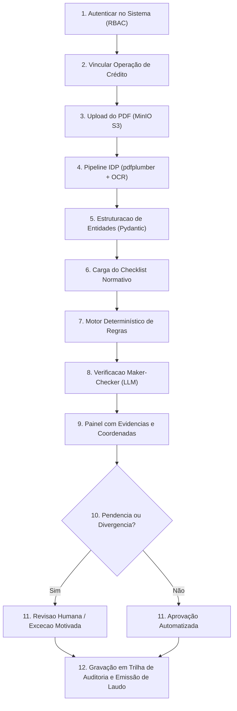

# Requisitos de Negocio e Especificacoes Funcionais

Este documento detalha o conjunto formal de requisitos funcionais (RF01 a RF15), requisitos não funcionais e as dores operacionais mapeadas a partir da Consulta Pública BNDES nº 01/2025.

---

## 1. Dores Operacionais Identificadas no BNDES

O processo tradicional de verificação de conformidade cadastral e documental em operações de crédito e financiamento apresenta desafios severos:

- **Elevado Volume Documental**: Multiplas certidoes, contratos sociais, balancos e licencas por proponente.
- **Heterogeneidade Estrutural**: Informacoes espalhadas em texto livre, tabelas financeiras, carimbos e PDFs digitalizados de baixa resolucao.
- **Consultas Fragmentadas**: Necessidade de cruzar dados com certidoes federais, estaduais, FGTS, CNDT e registros de falencia.
- **Vulnerabilidade a Erro Humano**: Fadiga em conferencias repetitivas pode resultar na aprovacao inadvertida de certidoes vencidas.
- **Dificuldade de Auditoria**: Reconstituir o conjunto probatório que fundamentou uma aprovação de anos anteriores demanda desarquivamento manual moroso.

---

## 2. Jornada do Usuário Analista

---

## 3. Catalogo de Requisitos Funcionais (RF01 a RF15)

| ID       | Requisito Funcional                | Prioridade  | Criterio de Aceite Formal                                                                                    |
| :------- | :--------------------------------- | :---------- | :----------------------------------------------------------------------------------------------------------- |
| **RF01** | **Autenticacao e RBAC**            | Alta        | Suporte a autenticacao segura por token JWT com perfis segregados: `Admin`, `Analista`, `Auditor`.           |
| **RF02** | **Ingestao e Armazenamento**       | Alta        | Upload de arquivos PDF de ate 50MB, validacao binaria (`%PDF-`) e persistencia duravel no MinIO S3.          |
| **RF03** | **Pipeline IDP e OCR**             | Alta        | Extracao vetorial com fallback automatico para OCR Tesseract em paginas digitalizadas (`CER <= 2.5%`).       |
| **RF04** | **Estruturacao de Entidades**      | Alta        | Reconhecimento de CNPJ, razoes sociais, datas de emissao, datas de validade e codigos de controle.           |
| **RF05** | **Checklist Declarativo**          | Alta        | Carregamento dinamico de checklists versionados em JSON Schema sem necessidade de rebuild da aplicacao.      |
| **RF06** | **Motor de Regras Determinístico** | Alta        | Validacao booleana e temporal de certidoes (CND, CRF, CNDT, Falencia) com tolerancia zero a pendencias.      |
| **RF07** | **Maker-Checker Assistido por IA** | Alta        | Avaliacao semantica de clausulas juridicas com citacao literal compulsoria de evidencia documental.          |
| **RF08** | **Exibicao de Evidencias**         | Alta        | Interface destacando o trecho exato e pagina do documento original que fundamentou a classificacao.          |
| **RF09** | **Revisao Humana e Excecoes**      | Alta        | Fluxo operacional para analista aprovar, rejeitar ou deferir excecao justificada com parecer tecnico formal. |
| **RF10** | **Trilha de Auditoria Imutavel**   | Alta        | Gravacao transacional de todos os eventos com timestamp UTC, ID do executor, hash do arquivo e laudo.        |
| **RF11** | **Relatorio Consolidado**          | Media       | Exportacao de laudo pericial em formato PDF/JSON estruturado para orgaos de controle externo (TCU/CGU).      |
| **RF12** | **Dashboard de Acuracia**          | Media       | Painel analitico exibindo indicadores de acuracia, recall, CER, tempo medio e taxa de revisao manual.        |
| **RF13** | **Camada de Conectores Externos**  | Media       | Integracao modular com adaptadores de APIs governamentais (Receita Federal, Caixa, TST, Juntas).             |
| **RF14** | **Alertas e Notificacoes**         | Baixa/Media | Disparo de alertas preventivos sobre certidoes proximas do vencimento durante a vigencia do contrato.        |
| **RF15** | **Agendamento e Reprocessamento**  | Baixa       | Execucao periodica automatizada via Celery Beat para revalidacao de proponentes ativos na carteira.          |

---

## 4. Requisitos Nao Funcionais (RNF)

- **RNF01 - Seguranca**: Comunicacao integralmente cifrada em transito (TLS 1.3) e segredos gerenciados via variaveis de ambiente auditadas pelo Gitleaks.
- **RNF02 - Desempenho**: Tempo de extracao e avaliacao de certidoes fiscais inferior a 5 segundos por pagina.
- **RNF03 - Rastreabilidade**: Imutabilidade da trilha de auditoria; nenhum registro de decisao pode ser alterado ou removido (`append-only`).
- **RNF04 - Disponibilidade**: Arquitetura stateless para a camada de API e workers, permitindo escalabilidade horizontal em containers Docker.
- **RNF05 - Soberania e Privacidade**: Hospedagem e processamento estritamente em territorio nacional, em conformidade com a LGPD e resolucoes do CMN.
- **RNF06 - Testabilidade**: Cobertura de testes unitarios e de integracao >= 70% e aprovacao obrigatoria de 100% no benchmark de Evals.
